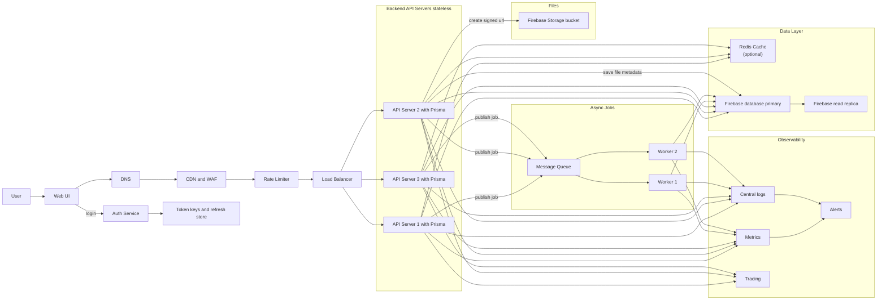

# Change: Implement Scalable Architecture from Mermaid Diagram

## Why
The current codebase has a basic horizontal scaling setup (NGINX + 3 backend + 2 frontend instances) but lacks several critical components defined in the target architecture: centralized authentication with token store, Redis caching, async job processing with message queues, and observability (logging, metrics, tracing, alerts). This proposal outlines the phased implementation of the complete architecture to achieve high availability, resilience, and proper SPOF mitigation.

## What Changes

### Phase 1: Auth Service & Token Store
- **BREAKING**: Migrate from local session handling to centralized token validation
- Implement Firebase Auth integration with centralized token key/refresh store
- Add token validation middleware for all API servers

### Phase 2: Data Layer Enhancement
- Add Redis cache layer (optional initially, for frequently accessed data)
- Migrate from MongoDB/Mongoose to Firebase Firestore with Firebase Admin SDK
- Configure Firestore security rules and indexes
- Leverage Firestore's built-in read replicas and HA

### Phase 3: Async Job Processing
- Implement message queue using Redis + BullMQ
- Create worker processes for background job execution
- Add job publishing from API servers to message queue

### Phase 4: File Storage
- Implement Firebase Storage signed URL generation
- Add file metadata storage in database
- Handle file upload/download through signed URLs (not server-side)

### Phase 5: Observability Stack
- Implement centralized logging (Winston + log aggregation)
- Add metrics collection (Prometheus-compatible metrics)
- Implement distributed tracing (OpenTelemetry)
- Configure alerting based on metrics and logs

### Phase 6: Edge Services & SPOF Mitigation
- Add rate limiting layer
- Configure CDN and WAF
- Document and implement HA strategies for each SPOF identified in diagram

## Impact

### Affected Specs (New Capabilities)
- `api-servers` - Stateless API server requirements
- `auth-service` - Authentication service with token store
- `data-layer` - Database, cache, and replica configuration
- `async-jobs` - Message queue and worker requirements
- `file-storage` - Firebase Storage integration
- `observability` - Logging, metrics, tracing, and alerting

### Affected Code
- `backend/src/index.ts` - Add middleware, logging, metrics
- `backend/src/config/` - Add Redis, Firebase Admin SDK config
- `backend/src/middleware/` - Add token validation, rate limiting
- `backend/src/workers/` - New worker processes
- `backend/src/jobs/` - Job definitions and queue publishers
- `backend/src/services/` - Storage, auth, cache services
- `docker-compose.yml` - Add Redis, worker containers
- `nginx/nginx.conf` - Add rate limiting configuration

### Breaking Changes Summary
| Component | Change | Migration Strategy |
|-----------|--------|-----------------------|
| Auth | Centralized token validation | Deploy new auth middleware, update clients |
| Database | MongoDB to Firestore migration | Run data migration scripts, update queries to Firestore SDK |
| Sessions | Remove local sessions | All sessions via token store |

## Architecture Diagram Reference

## SPOF Risks to Address
| Component | Risk | Mitigation |
|-----------|------|------------|
| DNS | Single DNS provider | Multi-provider DNS or Cloudflare |
| CDN | Single CDN region | Multi-region CDN distribution |
| Rate Limiter | Single rate limiter | Distributed rate limiting via Redis |
| Load Balancer | Single LB instance | LB failover or cloud LB |
| Auth Service | Single auth instance | Firebase Auth (managed HA) |
| Token Store | Single token store | Redis cluster or Firebase |
| Database | No HA primary | Firestore (managed HA) |
| Redis Cache | No redis replica | Redis Sentinel or cluster |
| Message Queue | Queue not HA | Redis cluster mode |
| File Storage | Single bucket region | Multi-region bucket |
